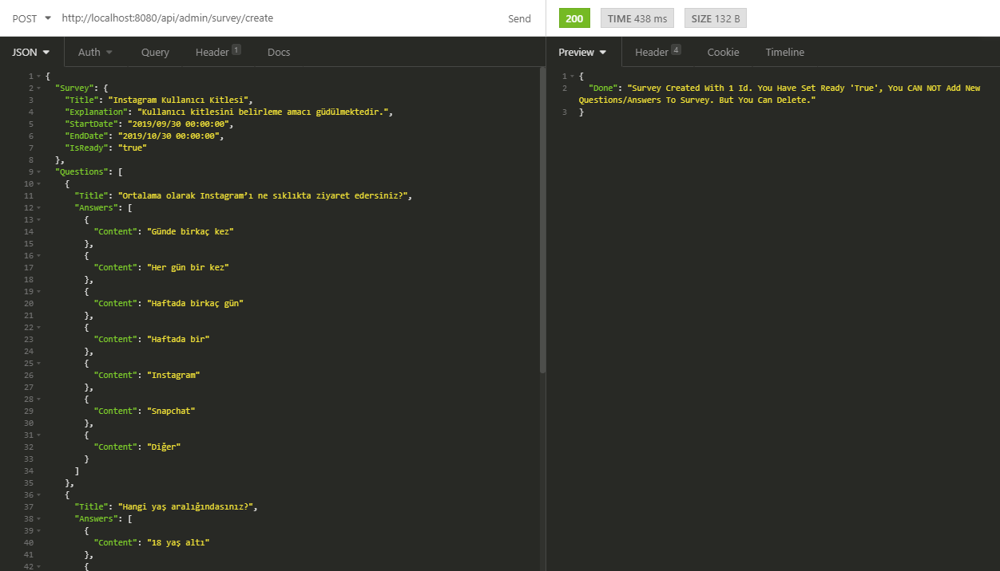
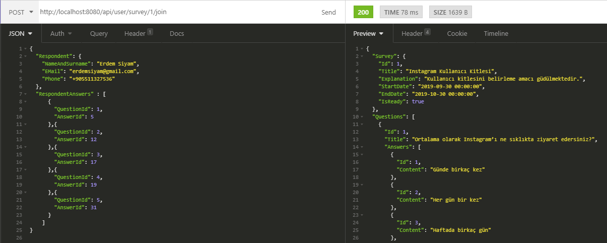
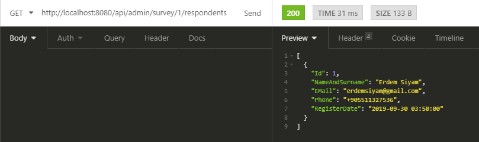

# Summary

This is a survey application. Easy to integrated to your own system as a microservice.

Used Spring MVC 5 and MySQL 8.

You can change the Database and properties(hibernate.properties) if you wish.

# API Requests

<a href="/img">CLICK FOR POST AND PUT JSON FORMATS.</a>

1. Admin Requests
	- Survey General Works
		-Get	api/admin/surveys               Get All Surveys
		-GET	api/admin/surveys/notready	Get Not Ready Surveys
		-GET	api/admin/survey/{id}		Get Single Survey
	- Survey Create Works
		-POST	api/admin/survey/create			Create Survey
		-PUT	api/admin/survey/{id}/addquestions	Add Questions To Survey
		-PUT	api/admin/survey/{id}/start		Set Survey Ready To Start (No need request body.)
	- Survey Result Informations
		-GET	api/admin/survey/{id}/respondents	Get All Respondents By Survey
		-GET	api/admin/survey/{id}/respondent/{id}	Get One Responder Answers For A Survey	
		-GET	api/admin/survey/{id}/results		Get Survey Results
		-DELETE	api/admin/survey/{id}/delete		Delete Survey
	- Respondents Information
		-GET	api/admin/respondents			Get All Respondents
		-GET	api/admin/respondent/{id}		Get Single Respondent
		-DELETE	api/admin/respondent/{id}/delete	Delete A Respondent
	- Question And Answers Information
		-GET	api/admin/questions			Get All Questions
		-GET	api/admin/question/{id}			Get Single Question By Id
		-PUT	api/admin/question/{id}/addanswers	Add Answers To Specified Question
		-DELETE	api/admin/question/{id}/delete		Delete Question
		-DELETE	api/admin/answer/{id}/delete		Delete Answer
2. User Requests
	- Participation Works
		-GET	api/user/surveys            	List Ready Surveys
		-GET	api/user/survey/{id}/join	Get Question And Answers Of Specified Survey.
		-POST	api/user/survey/{id}/join	Register To Survey By Answered Question.

# Example Request Screenshots.
- Create Survey

- Participation To Survey

- See Participations

